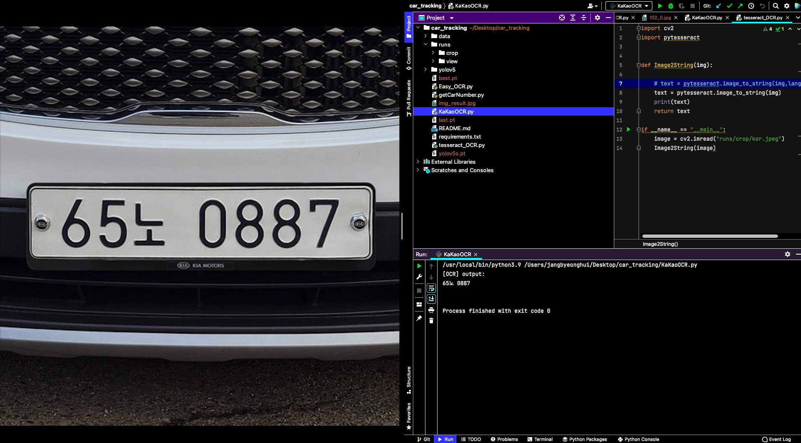

# Car_Tracking

차량 번호를 인식하여 차량 위치를 트랙킹하는 개발 레포지토리입니다.

## KakaoOCR.py
카카오 비전 API를 사용해서 OCR을 하는 모듈입니다. 한글 인식률이 뛰어나며 정확도면에서도 다른 tesseract보다는 우수하다.
그러나 네트워크를 통해서 OCR을 하기 때문에 느리다는 단점이 보여진다.

## tesseract_OCR.py
구글에서 제공하는 OCR 오픈 소스이다. 많은 부분에서 사용되어지지만 한글 인식률은 매우 떨어지는 모습을 보인다. 그러나
영문 OCR을 함에 있어서는 카카오 API보다 속도적인 측면에서 우세하다.

## Easy_OCR.py
다양한 언어를 지원하고 한글 인식률도 뛰어난 편이다. 다만 CPU를 사용하여 OCR을 하였을 때 속도적인 측면에서 느리다는 단점이 있다.
그러나 GPU를 사용할 수 있어 속도적인 면에서도 개선 시킬 수 있는 방안이 보인다.

## 2022년 2월 25일 Test OCR 결과

위 3가지 중 카카오 API를 사용한 결과이다. 어느 정도 선명한 이미지를 제공한다면은 정확한 문자 인식을 보여주고 있다.