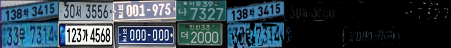
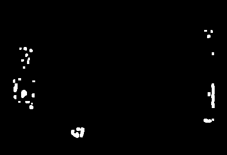
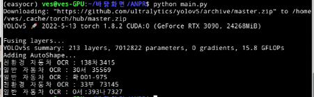

# Car_Tracking

차량 번호를 인식하여 차량 위치를 트랙킹하는 개발 레포지토리입니다.

## util - KakaoOCR.py
카카오 비전 API를 사용해서 OCR을 하는 모듈입니다. 한글 인식률이 뛰어나며 정확도면에서도 다른 tesseract보다는 우수하다.
그러나 네트워크를 통해서 OCR을 하기 때문에 느리다는 단점이 보여진다.

## util - tesseract_OCR.py
구글에서 제공하는 OCR 오픈 소스이다. 많은 부분에서 사용되어지지만 한글 인식률은 매우 떨어지는 모습을 보인다. 그러나
영문 OCR을 함에 있어서는 카카오 API보다 속도적인 측면에서 우세하다.

## util - Easy_OCR.py
다양한 언어를 지원하고 한글 인식률도 뛰어난 편이다. 다만 CPU를 사용하여 OCR을 하였을 때 속도적인 측면에서 느리다는 단점이 있다.
그러나 GPU를 사용할 수 있어 속도적인 면에서도 개선 시킬 수 있는 방안이 보인다.


실제 detect 결과 일부 '구'를 '7'로 인식하는 경우가 더 많다.

## util - detectElectronic.py
해당 번호판이 친환경 번호판인지 아닌지 구분하기 위한 모듈로서 open-cv를 이용하여 이미지를 처리함으로서 친환경 차량인지 아닌지를 구분한다.

### HSV Masking


HSV 값을 조절하여 최대한 친환경 번호판에 대해서만 검출 할 수 있도록 값을 조정하였다.

### 친환경 번호판 이진화


HSV 마스킹을 통해서 친환경 번호판만을 검출 할 수 있도록 한후 그 결과를 이진화 시킨 후에 픽셀 수를 계산하였다. 그래서 특정 픽셀 수 이상이면은 해당 번호판은
친환경 번호판이라고 표시할 수 있도록 하였다.

## main.py
[Kaggle](https://www.kaggle.com/code/rkuo2000/yolov5-alpr) 에 있는 Yolov5를 위한 차량 번호판 라벨링 데이터를 이용하여 YOLO를 학습시켰다. 학습
시킨 결과를 바탕으로 차량에서 번호판을 검출한 후 HSV 마스킹을 통해서 친환경 차량인지 아닌지를 구분한 후 OCR을 이용하여 번호판을 검출 하였다.

### 학습 결과


Kaggle에서 얻어진 데이터로 학습 시킨 결과 충분히 좋은 번호판 검출을 할 수 있는 것을 확인할 수 있다.

## 실행 방법
```jsunicoderegexp
# 이미 실행할 파일들에 대해서 설정이 되어있다.
python main.py
```

### 실제 결과



개발 결과 전체적인 차량의 이미지를 주더라도 차량의 부착된 번호판 번호만을 가져올 수 있었다. 더 나아가서 해당 번호판이 친환경 번호판인지 아닌지
구분하여 표시한다. 그러나 OCR 결과가 정확히 일치하지 않는데 이 부분은 OCR을 하는 부분에서 커스텀 데이터를 학습시킴으로서 해결할 가능성이 보여진다.

### 초기 개발 결과


위 3가지 중 카카오 API를 사용한 결과이다. 어느 정도 선명한 이미지를 제공한다면은 정확한 문자 인식을 보여주고 있다.


영상에서 계속해서 차량의 번호판을 검출하는 경우

