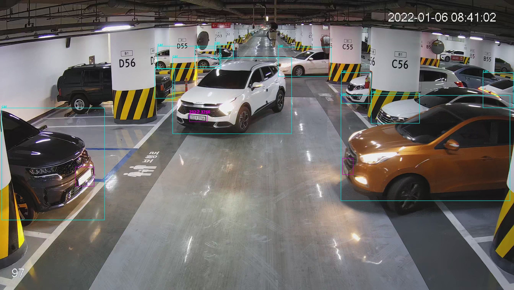
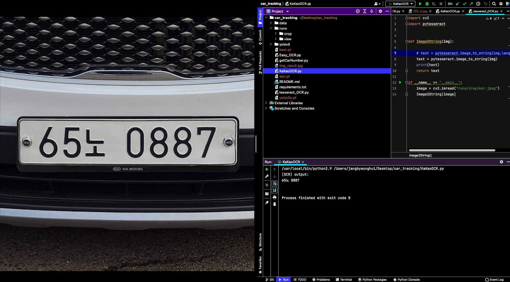

# Car_Tracking

차량 번호를 인식하여 차량 위치를 트랙킹하는 개발 레포지토리입니다.

## KakaoOCR.py
카카오 비전 API를 사용해서 OCR을 하는 모듈입니다. 한글 인식률이 뛰어나며 정확도면에서도 다른 tesseract보다는 우수하다.
그러나 네트워크를 통해서 OCR을 하기 때문에 느리다는 단점이 보여진다.

## tesseract_OCR.py
구글에서 제공하는 OCR 오픈 소스이다. 많은 부분에서 사용되어지지만 한글 인식률은 매우 떨어지는 모습을 보인다. 그러나
영문 OCR을 함에 있어서는 카카오 API보다 속도적인 측면에서 우세하다.

## Easy_OCR.py
다양한 언어를 지원하고 한글 인식률도 뛰어난 편이다. 다만 CPU를 사용하여 OCR을 하였을 때 속도적인 측면에서 느리다는 단점이 있다.
그러나 GPU를 사용할 수 있어 속도적인 면에서도 개선 시킬 수 있는 방안이 보인다.

## getCarNuber.py & ANPR_V1.pt
기존 차량에 대해서만 Object Detection을 하였지만 원본 이미지 198개를 새로 라벨링하여 차량,보행자,차량 번호판에 대해서 class를 생성해서
학습시킨 가중치이다. 초기 가능성을 보기 위해 데이터가 인밸런싱 하다는 문제가 있지만, 초기 시험에는 문제가 없을 것이라 판단하였다.
이후 augumentation을 통해서 500장 정도로 이미지 수를 부풀려서 학습하였다. 그 후 학습 시킨 가중치를 이용하여 object를 detection을 하였으며,
특히 차량 번호판을 detect하면은 그 영역에 대해서만 OCR을 실행 시켜 번호판을 인식하도록 하였다.
밑에 이미지를 통해서 차량과 차량 번호판을 인식하고 OCR을 통해서 차량 번호판을 정확히 읽는 부분이다. 실제로는 OCR이 매우 부정확한 모습을 보였다.
또한, 데이터가 인밸런싱하고 정확한 라벨링이 이루어지지 않아 번호판을 정확히 detect하지 못하는 모습도 보인다.
그러나 번호판에 대한 detection을 높이고 번호판을 선명하게 보일 때에만 OCR을 하게 된다면은 차량 번호판을 이용하여 차량을 트랙킹 할 수 있다는 가능성을 확인하였다.

실제 detect 결과 일부 '구'를 '7'로 인식하는 경우가 더 많다.

### 2022년 2월 25일 Test OCR 결과

위 3가지 중 카카오 API를 사용한 결과이다. 어느 정도 선명한 이미지를 제공한다면은 정확한 문자 인식을 보여주고 있다.

